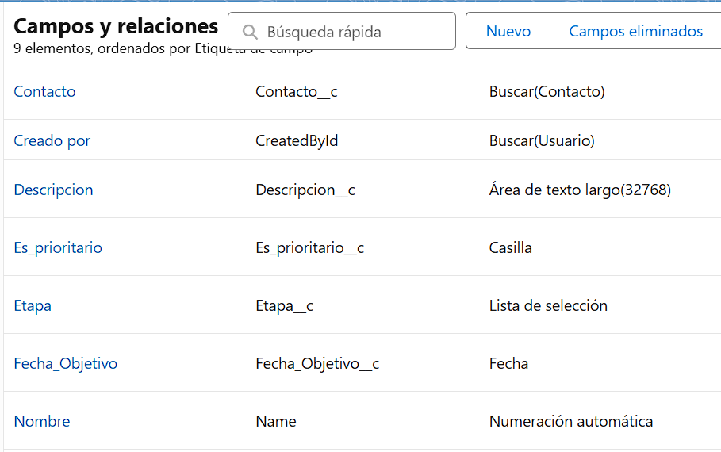

# Documentación Técnica - Sistema de Seguimiento de Actividades Comerciales

## Resumen

Se desarrolló una solución completa en Salesforce para el seguimiento de actividades comerciales con contactos. La solución de la Evaluación Técnica incluye un objeto personalizado, automatización con Flow, componente visual personalizado con LWC, y validaciones de negocio con Apex Trigger.

---

## Componentes Implementados

### 1. Objeto Personalizado "Seguimiento__c"

**Campos:**

- **Name (Auto Number):** {0} - Identificador único secuencial
- **Etapa__c (Picklist):** Pendiente, En Proceso, Completado
- **Descripción__c (Long Text):** Detalles específicos de la actividad
- **Contacto__c (Lookup):** Relación con Contact estándar
- **Fecha_Objetivo__c (Date):** Fecha límite para completar la tarea
- **Es_prioritario__c (Checkbox):** Marcador de prioridad

### 2. **Relacionar Seguimiento con el objeto estándar Contact**

Se modificó la Lightning Record Page por defecto de `Contacto` agregandole una lista relaciona dinamica

### 3. Screen Flow "Crear Seguimiento"

Se automatizó la creación de registros de seguimiento mediante una interfaz guiada en páginas.

**Funcionalidades implementadas:**

- Captura de datos del seguimiento mediante formulario
- Creación automática de registros vinculados al contacto seleccionado
- Manejo de errores con pantalla secundaria para mostrar mensajes de error al crear.

El Flujo **`Crear Seguimiento`** está disponible desde un botón en la página de Contact. Se asignó como una acción en la seccion **`Acciones de Lightning Experience y la aplicación móvil Salesforce`**

### 4. **Modificación UI**

Se creó una aplicación específica para el workflow de Gestión de Seguimientos, con los tab de Contacto y Seguimiento personalizado, además de la Lista Relacionada en la Record Page de  Contactos.

### 5. Implemetación de Lightning Web Component "progressBar”

Se visualiza en tiempo real el progreso de seguimientos por contacto.

**Características :**

- Conexión reactiva con datos mediante @wire decorator
- Cálculo automático de porcentajes
- Interfaz responsive utilizando Salesforce Lightning Design System (SLDS)
- Manejo de estados: datos cargados, sin datos, y errores

### 6. Validación con Apex Controller "ValidacionSeguimientoTrigger”

Se mplementó la regla de negocio - máximo 5 seguimientos pendientes por contacto.

**Implementación:**

- Trigger before insert/update para validación temprana
- Uso de SOQL agregado para eficiencia en operaciones bulk
- Mensajes de error descriptivos

---

## Recursos de Aprendizaje

### Documentación Oficial Salesforce:

- **Trailhead Modules:**
    - Apex Basics & Database - Fundamentos de programación en Salesforce
    - Lightning Web Components Basics - Desarrollo de componentes modernos
    - Flow Builder - Automatización declarativa
    - Customize a Record Page - Diseño de interfaces
- **Developer Documentation:**
    - Salesforce Developer Guide - Referencia técnica completa
    - LWC Developer Guide - Prácticas y patrones
    - SOQL and SOSL Reference - Uso de consultas

### Recursos Adicionales:

- **Salesforce Stack Exchange** - Resolución de problemas específicos
- **Salesforce CLI Documentation** - Comandos y configuración
- https://www.youtube.com/watch?v=quB_693g7dM
- https://www.youtube.com/watch?v=oujfZjQc_2I&list=PLWgzSrReOBh7C0BonXhOTWL98e1TuJueC&index=2

---

## Dificultades Enfrentadas y Soluciones

### 1. **Configuración del entorno de desarrollo**

**Problema:** Inicialmente intenté usar el modo de desarrollo local (`sf lightning dev component`) pero obtuve errores al intentar importar la clase Apex.

**Solución adoptada:** Cambié mi estrategia a desarrollo directo en la org usando deploy continuo con Salesforce CLI. Esto me permitió probar la funcionalidad completa inmediatamente.

### **2. Sintaxis deprecadas y cambios en la plataforma**

**Problema:** Durante el desarrollo encontré varios ejemplos en línea que utilizaban sintaxis antigua o deprecada.

- **API Versions obsoletas:** Muchos ejemplos usaban versiones anteriores a la 56.0
- **Metadata structure:** Algunas configuraciones de `.js-meta.xml` ya no eran válidas
- **CLI commands:** Comandos `sfdx` en lugar de la nueva sintax

**Solución adoptada:**

- Consulté siempre la documentación oficial más reciente
- Verifiqué versiones de API antes de implementar
- Utilicé las herramientas CLI más actuales (`sf` en lugar de `sfdx`)

### 3. **Manejo de errores en Flow**

**Problema:** Cuando el Trigger bloqueaba la creación de registros, el Flow mostraba un mensaje de error genérico poco amigable.

**Solución implementada:** Agregué un flujo secundario para capturar y mostrar errores de manera más elegante:

- Configuré Fault Connector en el elemento Create Records
- Creé una pantalla de error personalizada
- Implementé mensajes más descriptivos para el usuario